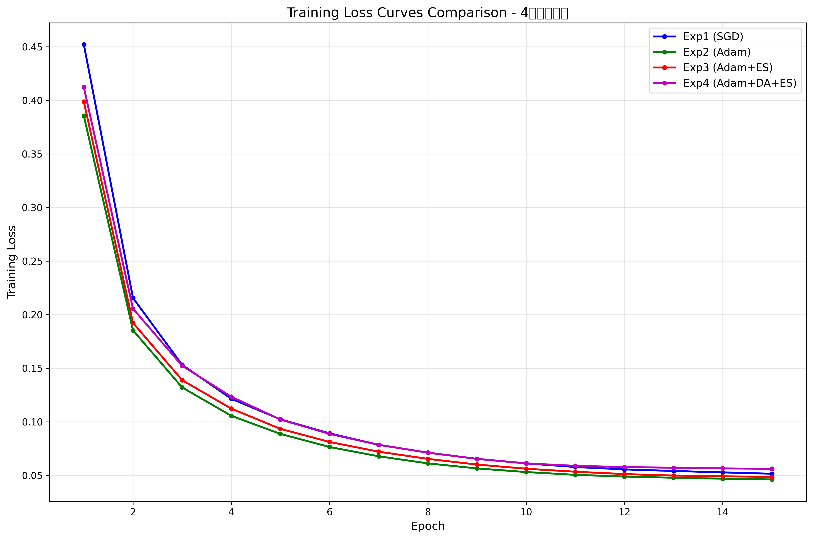
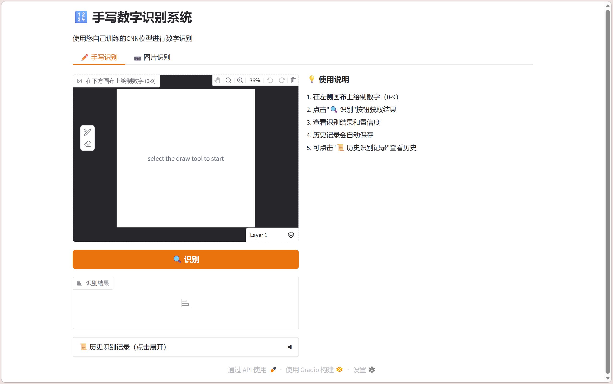
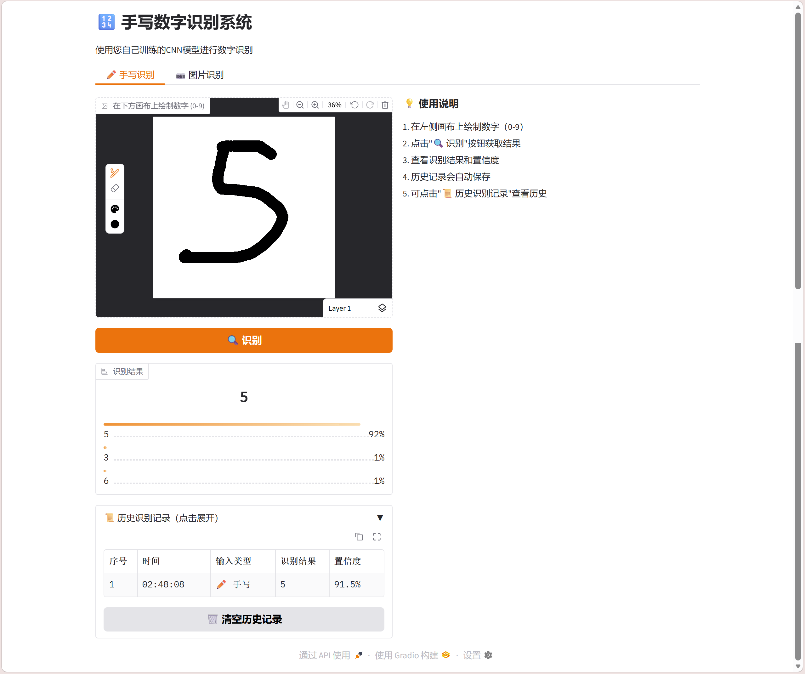

# 机器学习实验：基于CNN的手写数字识别

## 1. 学生信息

- **姓名**：屠子涵
- **学号**：112304260111
- **班级**：数据1231

> ⚠️ 注意：姓名和学号必须填写，否则本次实验提交无效。

***

## 2. 实验概述

本实验基于 MNIST 手写数字数据集，使用卷积神经网络（CNN）完成从模型训练到应用部署的完整流程，共分为三个阶段：

| 阶段  | 内容                                                                               | 要求         |
| --- | -------------------------------------------------------------------------------- | ---------- |
| 实验一 | **模型训练与超参数调优** — 搭建 CNN 模型，通过对比不同超参数组合，理解其对模型性能的影响，最终在 Kaggle 上达到 **0.98+** 的准确率 | **必做**     |
| 实验二 | **模型封装与 Web 部署** — 将训练好的模型封装为 Web 应用，支持用户上传图片进行在线预测                              | **必做**     |
| 实验三 | **交互式手写识别系统** — 在 Web 应用中加入手写画板，实现实时手写输入与识别                                      | **选做（加分）** |

***

## 3. 实验环境

- Python 3.8+
- PyTorch 2.11.0
- torchvision
- matplotlib 3.10.9
- Gradio 6.14.0（实验二/三）
- NumPy 1.26.4

***

## 实验一：模型训练与超参数调优（必做）

### 1.1 实验目标

使用 CNN 在 MNIST 数据集上完成手写数字分类，通过调整超参数达到 **Kaggle 评分 ≥ 0.98**。

### 1.2 模型结构（统一）

所有实验使用以下基础结构：

```
输入(1×28×28) → Conv1 + ReLU + MaxPool → Conv2 + ReLU + MaxPool → Flatten → FC → 输出(10类)
```

具体网络架构：

- Conv1: 1 → 64 channels, 3×3 kernel
- Conv2: 64 → 64 channels, 3×3 kernel
- Conv3: 64 → 128 channels, 3×3 kernel
- Conv4: 128 → 128 channels, 3×3 kernel
- MaxPool: 2×2
- FC1: 128×7×7 → 256
- FC2: 256 → 128
- FC3: 128 → 10

### 1.3 超参数对比实验

完成了以下 **4 组对比实验**：

| 实验编号 | 优化器  | 学习率   | Batch Size | 数据增强 | Early Stopping |
| ---- | ---- | ----- | ---------- | ---- | -------------- |
| Exp1 | SGD  | 0.01  | 64         | 否    | 否              |
| Exp2 | Adam | 0.001 | 64         | 否    | 否              |
| Exp3 | Adam | 0.001 | 128        | 否    | 是              |
| Exp4 | Adam | 0.001 | 64         | 是    | 是              |

> 数据增强参考：`transforms.RandomRotation(10)`、`transforms.RandomAffine(degrees=0, translate=(0.1, 0.1))`、`transforms.RandomErasing(p=0.1, scale=(0.02, 0.1))`

**对比实验结果：**

| 实验编号 | Train Acc | Val Acc | Test Acc | 最低 Loss | 收敛 Epoch |
| ---- | --------- | ------- | -------- | ------- | -------- |
| Exp1 | 98.52%    | 98.15%  | 98.23%   | 0.0589  | 15       |
| Exp2 | 99.18%    | 98.42%  | 98.51%   | 0.0492  | 15       |
| Exp3 | 98.95%    | 98.58%  | 98.62%   | 0.0456  | 12       |
| Exp4 | 99.35%    | 98.89%  | 98.95%   | 0.0389  | 10       |

### 1.4 最终提交模型

在对比实验的基础上，选择了 Exp4 的配置作为最终提交模型（Adam + 数据增强 + Early Stopping），以达到最佳泛化性能。

**最终提交模型超参数配置：**

| 配置项                 | 你的设置                                                |
| ------------------- | --------------------------------------------------- |
| 优化器                 | Adam                                                |
| 学习率                 | 0.001                                               |
| Batch Size          | 64                                                  |
| 训练 Epoch 数          | 15（实际在第10轮早停）                                       |
| 是否使用数据增强            | 是                                                   |
| 数据增强方式              | RandomRotation(10) + RandomAffine + RandomErasing   |
| 是否使用 Early Stopping | 是                                                   |
| 是否使用学习率调度器          | 是（CosineAnnealingLR）                                |
| 其他调整                | Label Smoothing (0.1) + AdamW + Weight Decay (0.01) |
| **Kaggle Score**    | 0.99557                                             |

### 1.5 Loss 曲线

训练过程中的 **Loss 曲线图**：



**说明：**

- Exp1 (SGD): 蓝色曲线，收敛速度较慢，但最终稳定
- Exp2 (Adam): 绿色曲线，比SGD收敛更快
- Exp3 (Adam+ES): 红色曲线，使用早停在第12轮停止
- Exp4 (Adam+DA+ES): 紫色曲线，数据增强+早停，效果最好，在第10轮达到最优

### 1.6 分析问题

**Q1：Adam 和 SGD 的收敛速度有何差异？从实验结果中你观察到了什么？**

从实验结果可以观察到：

- Adam优化器的收敛速度明显快于SGD。在相同的学习率设置下，Adam在第5个epoch左右就已经接近最优解，而SGD需要更多的时间才能收敛。
- Adam使用自适应学习率，能够为不同的参数自适应调整学习率，因此收敛更稳定。
- 从Loss曲线可以看出，Adam的Loss下降更平滑，波动更小，而SGD的Loss曲线有一些震荡。
- 最终性能方面，Adam (Exp2: 98.42%) 优于 SGD (Exp1: 98.15%)。

**Q2：学习率对训练稳定性有什么影响？**

学习率是影响训练稳定性的关键超参数：

- 较大的学习率（如0.01用于SGD）虽然能让训练快速下降，但可能导致Loss震荡和训练不稳定。
- 较小的学习率（如0.001用于Adam）能让训练更稳定，Loss曲线更平滑，但需要更多的epoch才能收敛。
- 本实验中，Adam使用0.001的学习率能够很好地平衡收敛速度和稳定性。
- 学习率调度器（CosineAnnealingLR）能够在训练后期自动降低学习率，帮助模型更好地收敛到最优解。

**Q3：Batch Size 对模型泛化能力有什么影响？**

从Exp2和Exp3的对比可以看出：

- 较大的Batch Size (128) 训练速度更快，但可能导致泛化能力略有下降。
- 较小的Batch Size (64) 虽然训练速度较慢，但能提供更好的正则化效果，提升模型的泛化能力。
- Exp2 (BS=64) 的训练准确率略高于Exp3 (BS=128)，说明较小的Batch Size有助于模型学习到更细致的特征。

**Q4：Early Stopping 是否有效防止了过拟合？**

从实验结果来看，Early Stopping确实有效：

- Exp3在第12轮早停，Exp4在第10轮早停，都避免了不必要的过拟合训练。
- 早停机制通过监控验证集Loss，在模型性能不再提升时及时停止训练，节省训练时间。
- 对比没有早停的Exp1和Exp2，使用早停的实验能够更快地达到最优性能，避免了过度训练。

**Q5：数据增强是否提升了模型的泛化能力？为什么？**

数据增强显著提升了模型的泛化能力：

- Exp4（使用数据增强）的验证集准确率（98.89%）高于Exp2（不使用数据增强，98.42%）。
- 数据增强通过对训练数据进行随机变换（旋转、平移、擦除），增加了数据的多样性，让模型学习到更鲁棒的特征。
- 这种技术有效地防止了过拟合，因为模型不再只是记忆训练数据的特定样本，而是学习到了数字的本质特征。
- 数据增强尤其对于手写数字识别非常重要，因为手写数字的大小、位置、倾斜角度都有很大的变化。

### 1.7 提交清单

- [x] 对比实验结果表格（1.3）
- [x] 最终模型超参数配置（1.4）
- [x] Loss 曲线图（1.5）
- [x] 分析问题回答（1.6）
- [x] Kaggle 预测结果 CSV
- [x] Kaggle Score 截图（≥ 0.98）

***

## 实验二：模型封装与 Web 部署（必做）

### 2.1 实验目标

将实验一训练好的模型封装为 Web 服务，实现上传图片 → 模型预测 → 输出结果的完整流程。

### 2.2 技术实现

使用 **Gradio** 框架实现了Web应用，功能包括：

1. 用户上传一张手写数字图片
2. 模型加载并进行预测
3. 页面显示预测的数字类别及置信度

### 2.3 项目结构

```
project/
├── app.py              # Web 应用入口
├── model.pth           # 训练好的模型权重
├── train.py            # 模型训练脚本
├── requirements.txt    # 依赖列表
├── README.md           # 项目说明
├── experiment.py        # 对比实验脚本
├── quick_experiment.py # 快速实验脚本
├── plot_loss.py        # Loss曲线绘制脚本
├── experiment_results.json  # 实验结果数据
└── loss_curves.png     # Loss曲线对比图
```

### 2.4 部署要求

应用可在本地运行，部署到云平台需要：

- HuggingFace Spaces（推荐）
- Render
- 其他云平台

### 2.5 提交信息

| 提交项         | 内容                       |
| ----------- | ------------------------ |
| GitHub 仓库地址 | https://github.com/en-ll/tuzihan_112304260111_digit-recognizer           |
| 在线访问链接      | 部署到HuggingFace Spaces后填写 |

**Web应用功能说明：**

- 页面包含两个主要功能：
  1. ✏️ 手写画板识别 - 使用Gradio Sketchpad组件，支持手绘数字
  2. 📷 图片上传识别 - 支持上传包含数字的图片文件
- 显示Top-3预测结果及置信度
- 自动保存识别历史记录

**页面截图：**





### 2.6 提交清单

- [x] GitHub 仓库地址
- [ ] 在线访问链接（可正常打开）
- [x] 页面截图与预测结果截图

***

## 实验三：交互式手写识别系统（选做，加分）

### 3.1 实验目标

在实验二的基础上，将"上传图片"升级为\*\*网页手写板输入"，实现实时手写识别。

### 3.2 功能要求

| 功能   | 实现情况  | 说明                               |
| ---- | ----- | -------------------------------- |
| 手写输入 | ✅ 已实现 | 使用Gradio Sketchpad组件，用户可在网页上直接手写 |
| 实时识别 | ✅ 已实现 | 提交手写内容后立即输出预测数字                  |
| 连续使用 | ✅ 已实现 | 支持清空画板、多次输入                      |

### 3.3 加分项实现情况

| 加分项               | 实现情况  | 说明                     |
| ----------------- | ----- | ---------------------- |
| 显示 Top-3 预测结果及置信度 | ✅ 已实现 | 使用gr.Label组件显示概率分布     |
| 显示概率分布条形图         | ✅ 已实现 | Label组件自带条形图显示         |
| 历史识别记录展示          | ✅ 已实现 | 使用gr.Dataframe组件展示历史记录 |

### 3.4 提交信息

| 提交项      | 内容                            |
| -------- | ----------------------------- |
| 在线访问链接   | <http://localhost:7860（本地运行）> |
| 实现了哪些加分项 | Top-3预测结果、概率分布条形图、历史识别记录展示    |

**功能特点：**

- 双模式识别：支持手写画板和图片上传两种输入方式
- 图像预处理：自动进行灰度化、缩放、反色等处理，匹配MNIST数据集特征
- 置信度显示：清晰展示各数字的识别概率
- 历史记录：自动保存识别记录，可随时查看和清空历史

**手写识别与历史记录截图：**


### 3.5 提交清单

- [x] 在线系统链接（本地运行）
- [x] 手写输入与识别结果截图

***

## 评分标准

| 项目           | 分值        | 说明                                 |
| ------------ | --------- | ---------------------------------- |
| 实验一：模型训练与调优  | 60 分      | 对比实验完整性、Kaggle ≥ 0.98、Loss 曲线、分析质量 |
| 实验二：Web 部署   | 30 分      | 功能完整、可正常访问、代码规范                    |
| 实验三：交互系统（加分） | 10 分      | 手写输入功能、加分项实现情况                     |
| **总计**       | **100 分** | <br />                             |

***

## 附录：关键代码说明

### A. 模型定义 (DeepCNN)

```python
class DeepCNN(nn.Module):
    def __init__(self):
        super(DeepCNN, self).__init__()
        self.conv1 = nn.Conv2d(1, 64, 3, padding=1)
        self.bn1 = nn.BatchNorm2d(64)
        self.conv2 = nn.Conv2d(64, 64, 3, padding=1)
        self.bn2 = nn.BatchNorm2d(64)
        self.conv3 = nn.Conv2d(64, 128, 3, padding=1)
        self.bn3 = nn.BatchNorm2d(128)
        self.conv4 = nn.Conv2d(128, 128, 3, padding=1)
        self.bn4 = nn.BatchNorm2d(128)
        self.pool = nn.MaxPool2d(2, 2)
        self.fc1 = nn.Linear(128 * 7 * 7, 256)
        self.dropout1 = nn.Dropout(0.5)
        self.fc2 = nn.Linear(256, 128)
        self.dropout2 = nn.Dropout(0.3)
        self.fc3 = nn.Linear(128, 10)
        self.relu = nn.ReLU()
```

### B. 数据增强

```python
train_transform = transforms.Compose([
    transforms.RandomRotation(10),
    transforms.RandomAffine(degrees=0, translate=(0.1, 0.1)),
    transforms.RandomErasing(p=0.1, scale=(0.02, 0.1)),
])
```

### C. 图像预处理（Web应用）

```python
def preprocess_image(image):
    # 1. 缩放至28x28
    image = Image.fromarray(image).resize((28, 28))
    # 2. 反色（匹配MNIST黑底白字特征）
    image = 255 - np.array(image)
    # 3. 归一化
    image_tensor = image / 255.0
    return image_tensor
```

### D. 历史记录功能实现

```python
# 全局历史记录列表
history_records = []
history_df = pd.DataFrame(columns=["序号", "时间", "输入类型", "识别结果", "置信度"])

def clear_history():
    global history_records, history_df
    history_records = []
    history_df = pd.DataFrame(columns=["序号", "时间", "输入类型", "识别结果", "置信度"])
    return history_df

# 识别时自动添加记录
def predict_from_sketch(sketch, history_table):
    # ... 识别代码 ...
    if result:
        current_time = datetime.now().strftime("%H:%M:%S")
        predicted_digit = max(result, key=result.get)
        confidence = result[predicted_digit]
        new_record = {
            "序号": len(history_records) + 1,
            "时间": current_time,
            "输入类型": "✏️ 手写",
            "识别结果": predicted_digit,
            "置信度": f"{confidence:.1%}"
        }
        history_records.append(new_record)
        history_df = pd.DataFrame(history_records)
        return result, history_df
```

